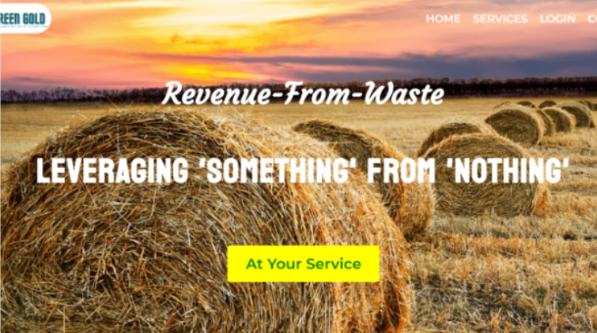
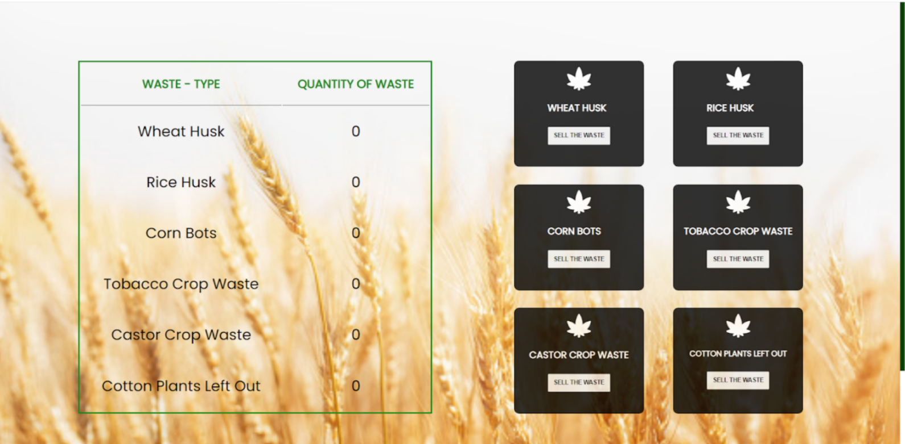

# Farmer Friendly Web App 🌾

This is a Web Application developed by the Web Development team as part of Interestship 4.0, aiming to connect farmers and bio-waste industries for better management of farm waste.

## 📜 Table of Contents

- [Overview](#overview)
  - [Introduction](#introduction)
  - [Screenshots](#screenshots)
- [Features](#features)
- [Tech Stack](#tech-stack)
- [Installation](#installation)


## 🌟 Overview

### Introduction
The Farmer Friendly Web App is designed to facilitate efficient management of agricultural waste by connecting farmers directly with bio-waste industries. This platform enhances the sustainability and profitability of agricultural practices by promoting better waste management solutions.

### Screenshots
#### 🏡 Home Page


####  👤 User Registration/Login 


####  📊 Dashboard



## 📜 Features
- **🔐 User Authentication**: Secure registration and login for users.
- **📋 Dashboard**: Personalized dashboard for farmers and industry users.
- **♻️ Waste Management**: Farmers can list farm waste products, and industries can browse available waste.
  

## 🛠️ Tech Stack

**Frontend**
- **React.js**: Used for building the user interface.
- **Material UI**: For designing responsive and visually appealing components.
- **CSS**: Custom styling for various components.

**Backend**
- **Spring Boot**: Framework for building the backend services.
- **MySQL**: Relational database management system for storing user and product data.

**Tools**
- **Postman**: For testing and documenting APIs.
- **Axios**: For making HTTP requests from the frontend to the backend.

## Installation

### Prerequisites
- Node.js
- Java
- Spring Boot
- MySQL

### Steps

1. **🔄 Clone the repository:**
   ```sh
   git clone https://github.com/yourusername/farmer-friendly-web-app.git
   cd farmer-friendly-web-app
   ```

2. **📦 Install frontend dependencies:**

```sh
Copy code
cd client
npm install
```

3. **🗄️ Set up MySQL database:**

- Create a database named farmer_friendly.
- Update the database configurations in application.properties.

4. **🔧 Run the backend server:**

```sh
Copy code
cd server
./mvnw spring-boot:run
```

5. **💻 Start the frontend:**

```sh
Copy code
cd client
npm start
```
